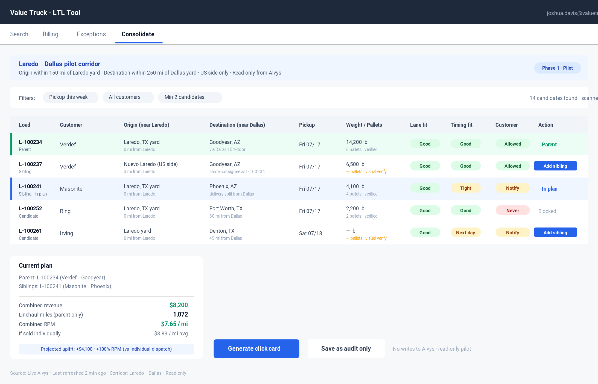
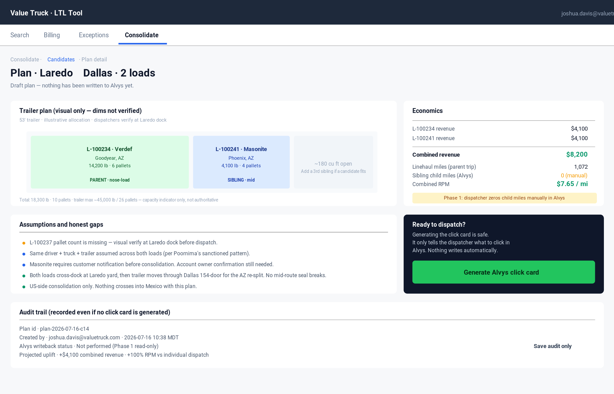
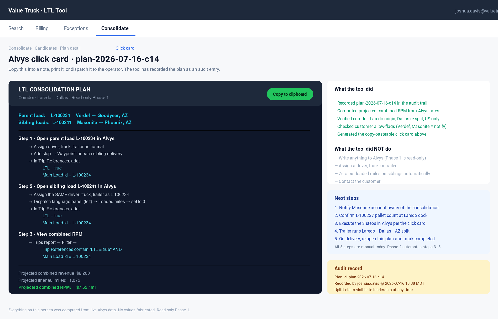

# Laredo → Dallas Consolidation Pilot

**Owner:** Joshua Davis · Value Truck + Value Logistics
**Sponsor:** Jason Payne
**Reviewers named on the call:** Jordan, Junior, Holly, Brandon (Dallas), Jose Skoog · optional later: the container operator on Moreno
**Scope-freeze date:** 2026-07-16 (Jason's 9:30 AM MDT walkthrough call)
**Target review:** tomorrow (Friday) or Monday
**Status:** DRAFT for Jason's review

---

## 1. What Jason asked for (in his words)

> *"identifying loads that come into Laredo that we could consolidate, run them up to Dallas, and then from there, re-split them out."*
>
> *"an upfront version where all we're doing is pulling data, consolidating, showing data, telling them what to do in Alvys… That doesn't require us to work with Alvys to get access to write data."*
>
> *"the default is all read only."*

That is the entire Phase 1 scope. Everything else in the broader LTL roadmap is deferred.

---

## 2. Phase 1 — "Show the opportunity, tell them the Alvys clicks"

### 2.1 Objective

Give one dispatcher one screen where they can:

1. See LTL-consolidation candidates that fit the **Laredo → Dallas** corridor
2. Understand *why* each candidate was surfaced (lane fit, timing fit, customer allow-flag, capacity hint)
3. See the **exact Alvys clicks** to combine them (Poornima's sanctioned path — waypoints, zero loaded miles, boolean LTL trip reference)
4. Copy a generated **trip-reference value** and paste it into Alvys manually

**What Phase 1 does not do:** write to Alvys, auto-zero miles, auto-assign drivers, auto-invoice, calculate accessorials, dispatch trucks, or make decisions. It is decision *support*, not decision *automation*.

### 2.2 What Phase 1 pulls from Alvys (all read-only, existing endpoints)

- `SearchLoadsAsync` — active loads originating within radius of Laredo
- `SearchLocationsAsync` — resolve customer sites near Laredo and Dallas
- `SearchCustomersAsync` — customer identity for the visibility-tier flag
- `ListTripStopsAsync` — pickup/delivery timing for the fit check
- `SearchDriversAsync` / `SearchTrucksAsync` / `SearchTrailersAsync` — reference-only for context
- (Optional) `ListLoadNotesAsync` — surface any note that says "cannot consolidate" or similar

**Data-quality note:** Jordan is working upstream to improve pallet count / weight / commodity capture at intake. The pilot must tolerate missing values honestly — never fabricate a piece count or weight. Missing fields render as `—` and downgrade the capacity-fit factor to `Unknown → visual verify at warehouse`.

### 2.3 Explicit corridor constraint

Only one corridor for Phase 1: **origin within 150 miles of Laredo yard AND destination within 250 miles of Dallas yard.** Any candidate outside that box is filtered out. This keeps the pilot bounded, keeps the demo defensible, and matches the physical infrastructure Value Truck actually has in these two yards.

**The `ltl-search` screen still exists; the pilot adds a new "Consolidate" tab that operates only on this corridor.**

### 2.4 The three read-only signals the tool computes

Every candidate is scored on three explicit factors — no black boxes. All three cite Alvys data.

| Factor | What it measures | Source |
|---|---|---|
| **Lane fit** | Origin within 150 mi of Laredo yard, destination within 250 mi of Dallas yard | `SearchLocationsAsync` |
| **Timing fit** | Pickup within N days of a seed load's pickup, delivery window compatible | `ListTripStopsAsync` |
| **Customer allow-flag** | Per-customer `AllowConsolidation` policy: `Yes` / `Yes-with-notification` / `Never` / `Unknown → confirm with account owner` | Internal EF store, defaults to `Unknown` |

**No score, no percentage, no black box.** Each factor renders as a chip: green / yellow / red / gray. That's it. Simplicity is a Phase 1 feature.

### 2.5 The Alvys "click card" the tool generates

For any selected parent + children set, the tool prints a card the dispatcher pastes into Alvys manually. Verbatim instructions per Poornima's yard walkthrough with Holly:

```
LTL CONSOLIDATION PLAN — Laredo → Dallas
Parent load:    L-100234
Sibling loads:  L-100237, L-100241

Do this in Alvys:
  1. Open parent load L-100234
     → Assign driver, truck, trailer as normal
     → Add Stop → Waypoint for each sibling delivery
     → In Trip References, add:
          LTL = true
          Main Load Id = L-100234

  2. Open sibling load L-100237
     → Assign the SAME driver, truck, trailer
     → Dispatch language panel (left) → Loaded miles → set to 0
     → In Trip References, add:
          LTL = true
          Main Load Id = L-100234

  3. Repeat step 2 for L-100241

  4. To view combined RPM: Trips report → Filter →
       Trip References contain "LTL = true" AND "Main Load Id = L-100234"

Projected combined revenue: $12,400  (parent $4,100 + siblings $4,200 + $4,100)
Projected linehaul miles:   1,072
Projected combined RPM:     $11.57 / mile
```

Every value in that card comes from Alvys or from static config. Nothing fabricated.

### 2.6 What Phase 1 does *not* do (explicit non-goals)

- No Alvys writeback of any kind
- No auto-zeroing of loaded miles — the dispatcher does that manually in Alvys per the click card
- No driver assignment — the dispatcher does that manually in Alvys
- No accessorial calculation — Phase 3.5 material, deferred
- No billing readiness scoring — Phase 4 material, deferred
- No cross-border customs sensitivity — US-side only, per guardrails
- No customers beyond the corridor's default customer set (Verdef and whoever else feeds the Laredo yard)

---

## 3. Phase 2 — Alvys writeback (deferred, needs Alvys permission)

Jason's exact framing:

> *"we could possibly go upstream and start to update those loads to tell Alvys, yeah, these are LTL loads. This is the master load that's going to be the one that moves and the driver gets paid on… And then we worry about zeroing out miles for drivers, so we're not asking somebody to do that."*
>
> *"That's all Phase 2, because we have to be able to interact with Alvys's database at that point. So which means there's got to be an API that we can use to do it, and there's got to be permissions from Alvys, like they got to give us those permissions."*

**Phase 2 unlocks:**
- Set the LTL trip reference on parent + siblings automatically
- Zero out loaded miles on child trips automatically
- Guard against payroll double-pay (Failure 3e in the anti-failure map)
- Combined-RPM view without manual report filters

**Phase 2 preconditions (all external to the pilot code):**
1. Alvys grants Value Truck writeback API access (in-progress conversation, not scheduled)
2. Confirm the exact write endpoints and their contracts
3. Sign off in `docs/ltl-tool.md` per the per-operation approval process
4. Sandbox → production gate stays intact (`AlvysWriteOptions` already blocks the production host architecturally, locked by tests in PR #39)

**Phase 2 is not on the pilot's critical path.** The Phase 1 click-card approach is fully functional without it — it just requires a human to make the clicks Alvys already exposes to them today.

---

## 4. Adjacent systems the pilot must respect

Called out explicitly in the transcript so we do not step on them:

- **Jordan (data intake):** working upstream to improve pallet/weight/commodity capture at Laredo. Pilot consumes whatever quality Jordan delivers and degrades gracefully when fields are missing.
- **Ryland's yard app:** new application "on the yard" adding *"some ability to also identify."* Pilot is a peer, not a competitor. If Ryland's app produces structured signals (e.g. verified pallet counts at the dock), Phase 1 can read them the same way it reads Alvys — through Alvys, or through a shared source of truth Jordan controls. **No direct integration with Ryland's app in Phase 1.**
- **Brandon (Dallas):** operational reviewer, has been to Laredo. His feedback on the click card and the corridor filter is high-priority.
- **Jose Skoog:** operational reviewer, feedback wanted.
- **Junior / Holly (Buckeye yard visit veterans):** already provided the operational context on the current dummy-load workaround.
- **The container operator on Moreno:** Jason said *"we may or may not incorporate him, probably not quite yet."* Explicitly deferred.

---

## 5. Success criteria for the pilot

Phase 1 ships when:

- [ ] A dispatcher in Dallas or Laredo can open the LTL tool, select the **Consolidate** tab, and see today's real candidate list for the corridor
- [ ] Every candidate shows lane / timing / customer chips with the source Alvys record id
- [ ] The dispatcher can select a parent + one or more siblings and generate the click card
- [ ] The generated card is copy-pastable and matches Poornima's walkthrough exactly
- [ ] The tool records the plan as an internal audit entry with a projected combined-RPM value
- [ ] Missing pallet/weight/commodity data renders honestly as `—` with the visual-verify prompt
- [ ] Nothing writes to Alvys. Read-only end-to-end.
- [ ] Jason, Jordan, Junior, Holly, Brandon, and Jose Skoog have reviewed and signed off

---

## 6. Questions for the next review meeting

Per Jason's request: *"talk through and ask additional questions that we need to make sure we're not missing something. Ask them what their wish list is that goes beyond what we got here."*

**For Jordan (data owner):**
1. What's the realistic ETA on the pallet-count / weight / commodity data-quality upstream fix? What percentage capture do you expect at Laredo intake for Phase 1?
2. Is there a Verdef-specific field mapping we should hard-code, or does the general Alvys shape cover it?
3. If we surface a missing-data flag to the dispatcher, do you want the same flag routed back to your team so intake can chase it?

**For Junior (asset ops):**
1. Corridor bounds: 150 mi radius from Laredo yard on origin, 250 mi radius from Dallas yard on destination. Right size for Phase 1, or should we widen/narrow?
2. If the click card says "assign the same driver, truck, trailer" but the dispatcher already has a different driver in mind, what should the card do?
3. Do you want to see driver / truck / trailer suggestions on the card, or is that a Phase 2 concern?

**For Holly (load builder):**
1. Does the click card format match how you'd want to see it? Any Alvys screen names or field names we got wrong?
2. Would a "print this card" or "copy this card to clipboard" button be worth more than a nicer visual layout?

**For Brandon (Dallas ops):**
1. On the Dallas re-split side, what data would you want on the click card that's not there? Local-delivery driver assignment? Dock-door availability? Something else?
2. Is Dallas 20+ acre / 154-door yard capacity ever a real bottleneck on the Phase 1 volumes we'd expect? (This affects whether Phase 2 needs a dock-availability signal.)

**For Jose Skoog:**
1. Any customer relationships that make you nervous about the Laredo → Dallas corridor specifically? Any Phase 1 customers we should filter out even inside the corridor?

**For Jason:**
1. Sign-off on: only Laredo → Dallas for Phase 1, no exceptions.
2. Sign-off on: click-card format is the Phase 1 delivery mechanism, not a JSON export or an integration.
3. Alvys writeback timeline: when do we start the Alvys API access conversation with them? What's the earliest realistic date to start Phase 2 code?

---

## 7. Anti-failure map — which failure modes Phase 1 defeats

Cross-referenced against `ROADMAP.md § 2a`:

| Failure mode | How Phase 1 defeats it |
|---|---|
| **3a TMS mismatch** | Click card uses Poornima's sanctioned Alvys pattern verbatim. No dummy loads. |
| **3c Bad dims at intake** | Missing fields render as `—`, capacity fit degrades to `Unknown → visual verify`. Jordan owns upstream fix. |
| **3e Payroll double-pay** | Click card explicitly instructs zero-loaded-miles on siblings. Phase 2 automates it. |
| **3f Seal integrity** | Corridor is Laredo-yard → Dallas-yard only. Consolidation happens at yard hand-off, never mid-route. |
| **3h Commission structure** | Every generated plan writes an internal audit entry with projected combined revenue. Leadership can see the value at any time. |
| **3i Terminal gap** | Corridor is bounded by Laredo and Dallas real terminal capacity. |
| **3j Insurance / liability** | US-side only, no cross-border consolidation. |
| **3m Culture / atoms** | "Consolidate" tab explicitly reframes the work as shipment planning, not load listing. |

Phase 1 does not defeat 3b (NMFC), 3d (accessorials), 3g (OCR), 3k (EDI), 3l (FAB), 3n (pricing), 3o (regulatory) — those live in later roadmap phases. Deferring them is intentional; the pilot is small on purpose.

---

## 8. Delivery timeline

- **Today (Thursday 2026-07-16):** this document + UI mockups + a PR to the repo
- **Friday or Monday:** Jason review, adjust
- **After review meeting with Jordan / Junior / Holly / Brandon / Jose Skoog:** freeze Phase 1 scope
- **Phase 1 build:** starts after scope freeze, sits on top of the existing `ltl-search.ts` component as a new tab

Phase 0 stability work already merged on `main` (7 PRs: web-test CI job, null-last sort tests, sandbox arming tests, LTL API surface contract test, UAT health probes, Alvys-only source-of-truth policy, anti-failure map) is the foundation this pilot sits on.

---

## 9. UI mockups

Three screens for the pilot. All three are illustrative — real values would render from live Alvys.

### Screen 1 · Candidate list

The `Consolidate` tab, corridor-bounded to Laredo → Dallas. Each candidate scored on three simple chips: lane fit, timing fit, customer allow-flag. No black-box scoring. Missing dims render as `—` with a visual-verify prompt.



### Screen 2 · Plan detail

The dispatcher selects a parent + siblings, sees the trailer allocation visually, the economics, the assumptions and honest gaps, and the audit-trail row that's recorded whether or not they generate the click card. Nothing has written to Alvys.



### Screen 3 · Alvys click card

Copy-pasteable instructions the dispatcher follows in Alvys. Verbatim Poornima pattern: waypoints on parent, zero loaded miles on siblings, boolean LTL trip reference, main-load id, AND/OR filter for combined RPM. Right column shows exactly what the tool did and did not do so nobody assumes automation that isn't there.


